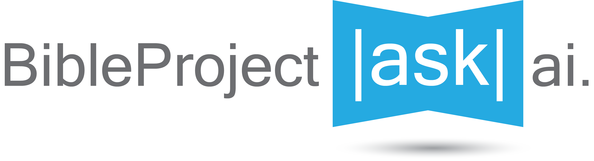

# Bible Project Chatbot

Welcome to the Bible Project Chatbot repository! This project aims to provide an interactive chatbot experience, allowing users to explore biblical content in an engaging and innovative way. We just want to help people experience the Bible as a unified story that leads to Jesus.

This project is live <a href="https://askbibleprojectai.com/">here.</a>

This is still a 'beta' version, so we would love to have feedback, suggestions, and contributions!

**This project is not affiliated with the BibleProject. Do not take responses as official BibleProject content. We encourage you to explore the original sources.**

## Features

- **Interactive Chat Interface**: Engage with the chatbot to receive biblical insights, stories, and more.
- **Dynamic Content Generation**: Utilizes Next.js for server-side rendering and static site generation to ensure fast load times and dynamic content updates.
- **Responsive Design**: Crafted with a mobile-first approach ensuring a great experience across all devices.

## Technology Stack

- **Next.js**
- **OpenAI GPT Turbo 3.5**
- **Pinecone Vector Database**
- **Vercel KV for Auth**
- **Supabase to store sources**
- **Vercel for hosting**

## Getting Started

To get a local copy up and running follow these simple steps.

### Prerequisites

- Node.js
- npm or pnpm

### Running locally

1. Clone the repo
  ```sh
  git clone https://github.com/Lars-Ostervold/bible-project-chatbot
  ```
2. Install packages
  ```sh
  pnpm install
  ```
3. Run local server
  ```sh
  npm run dev
  ```
4. If you're using the chat feature (or anything else requiring an environment variable), you'll need to specify an OpenAI API key. I would copy the [`.env.example`](command:_github.copilot.openRelativePath?%5B%7B%22scheme%22%3A%22file%22%2C%22authority%22%3A%22%22%2C%22path%22%3A%22%2Fc%3A%2FUsers%2FOster%2FProjects%2Fbible-project-chatbot%2F.env.example%22%2C%22query%22%3A%22%22%2C%22fragment%22%3A%22%22%7D%5D "c:\Users\Oster\Projects\bible-project-chatbot\.env.example") file, rename it to [`.env.development.local`](command:_github.copilot.openRelativePath?%5B%7B%22scheme%22%3A%22file%22%2C%22authority%22%3A%22%22%2C%22path%22%3A%22%2Fc%3A%2FUsers%2FOster%2FProjects%2Fbible-project-chatbot%2F.env.development.local%22%2C%22query%22%3A%22%22%2C%22fragment%22%3A%22%22%7D%5D "c:\Users\Oster\Projects\bible-project-chatbot\.env.development.local"), then fill in the API keys as you need them. Remember to add `.env*` to your [`.gitignore`](command:_github.copilot.openRelativePath?%5B%7B%22scheme%22%3A%22file%22%2C%22authority%22%3A%22%22%2C%22path%22%3A%22%2Fc%3A%2FUsers%2FOster%2FProjects%2Fbible-project-chatbot%2F.gitignore%22%2C%22query%22%3A%22%22%2C%22fragment%22%3A%22%22%7D%5D "c:\Users\Oster\Projects\bible-project-chatbot\.gitignore").

## Contributing

We would love to hear from people and we would be hype if you had some ideas you want to implement. Open an issue, submit a pull request, shoot me an [email](mailto:lars.ostervold.3@gmail.com) or fill out this [contact form](https://lars-ostervold.vercel.app/contact).

## Data Scraping

All the content was scraped from the BibleProject website with Selenium and BeautifulSoup. My scraping functions are in the Python folder. Eventually, I'll work on automating these so the content stays up to date.

**To-Do on Scraping:**
1. Scrape articles, and classroom transcripts.
2. Automate process to pull new content once per month.

## Frontend Credits

This project was forked from [here](https://github.com/vercel/ai-chatbot).

Source code was created by [Vercel](https://vercel.com) and [Next.js](https://nextjs.org) team members, with contributions from:

- Jared Palmer ([@jaredpalmer](https://twitter.com/jaredpalmer)) - [Vercel](https://vercel.com)
- Shu Ding ([@shuding\_](https://twitter.com/shuding_)) - [Vercel](https://vercel.com)
- shadcn ([@shadcn](https://twitter.com/shadcn)) - [Vercel](https://vercel.com)
